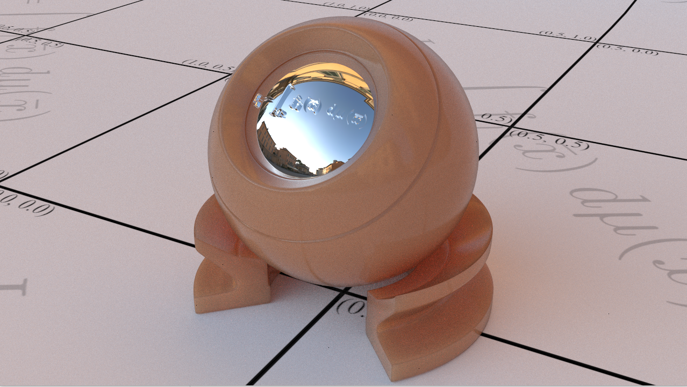
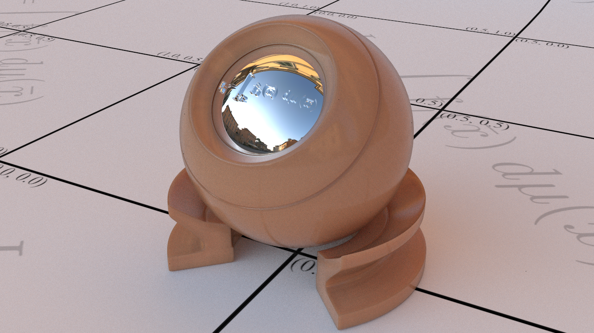

# Screenshots
<table> <tr>
    <td>  </td>
    <td>  </td>
</tr> <tr>
    <td>  </td>
    <td>  </td>
</tr></table>

# Library and external dependancy
- cuda
- glut
- glew

# Features
- Progressive rendering with GPU BVH acceleration
- Triangle mesh handling (uv, normal, material) and texturing
- Monte Carlo Path Tracing
- Reflection models and materials
- Volumn scattering
- Camera effects

# References

framework based on Matching Socks CUDA path tracer by Samuel Lapere, 2016 https://raytracey.blogspot.com

bvh based on the GPU ray tracing framework of Timo Aila, Samuli Laine and Tero Karras (Nvidia Research)

based on Source code for original framework: 
- https://code.google.com/archive/p/understanding-the-efficiency-of-ray-traversal-on-gpus/
- https://research.nvidia.com/publication/understanding-efficiency-ray-traversal-gpus-kepler-and-fermi-addendum
- https://mediatech.aalto.fi/~timo/HPG2009/

anti-aliasing, depth of field based on https://github.com/peterkutz/GPUPathTracer

material modeling, surface/media based on "Physically Based Rendering: From Theory To Implementation", by Matt Pharr, Wenzel Jakob, and Greg Humphreys https://github.com/mmp/pbrt-v3, http://pbrt.org

